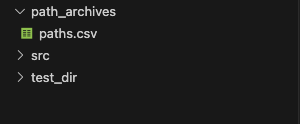
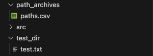
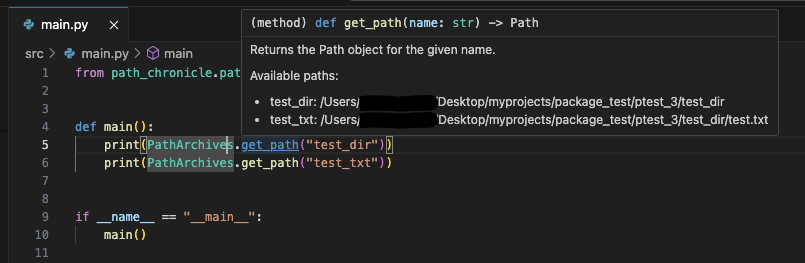

# path-chronicle

This library is for efficiently managing paths in a project.
This README describes the standard usage of this library and the commands that can be used.

## Standard Usage

### 1. Install

```bash
pip install path-chronicle
```

### 2. Set project root directory
<span style="color: red;">※Please run it first after installation</span>

```bash
# Set the root directory path of that project
pcsetpjroot .
```

### 3. Create a directory

```bash
pcmkdir test_dir
```

```csv
id,name,path,description
1,test_dir,test_dir,
```



### 4. Create a file

```bash
pctouch test_dir/test.txt
```

```csv
id,name,path,description
1,test_dir,test_dir,
2,test.txt,test_dir/test.txt,
```



### 5. Create a PathArchives

```bash
gpaths 
```

```python
from pathlib import Path


class PathArchives:
    """
    This class provides paths for various project directories and files.
    """

    test_dir = Path('/Users/{your dirctory}/Desktop/myprojects/package_test/ptest_3/test_dir')
    test_txt = Path('/Users/{your dirctory}/Desktop/myprojects/package_test/ptest_3/test_dir/test.txt')

    @staticmethod
    def get_path(name: str) -> Path:
        """
        Returns the Path object for the given name.

        Available paths:
        - test_dir: /Users/{your dirctory}/Desktop/myprojects/package_test/ptest_3/test_dir
        - test_txt: /Users/{your dirctory}/Desktop/myprojects/package_test/ptest_3/test_dir/test.txt
        """
        return getattr(PathArchives, name, None) or Path("")

```

### 6. Import PathArchives

```python
from path_chronicle.path_archives.path_archives import PathArchives

def main():
    print(PathArchives.get_path("test_dir"))
    print(PathArchives.get_path("test_txt"))

if __name__ == "__main__":
    main()
```

```
/Users/{your directory}/Desktop/myprojects/package_test/ptest_3/test_dir
/Users/{your directory}/Desktop/myprojects/package_test/ptest_3/test_dir/test.txt
```



The path saved to csv is relative to the project root, but the path is absolute when output.

## Commands
    
1. [Set Project Root Directory](#set-project-root-directory)
2. [Create a Directory and Save to CSV](#create-a-directory-and-save-to-csv)
3. [Create a File and Save to CSV](#create-a-file-and-save-to-csv)
4. [List All Paths in CSV](#list-all-paths-in-csv)
5. [Remove a Path from CSV](#remove-a-path-from-csv)
6. [Generate Paths Python File](#generate-paths-python-file)
7. [Add a Path to CSV](#add-a-path-to-csv)
8. [Remove a Path from CSV by Criteria](#remove-a-path-from-csv-by-criteria)


## Set Project Root Directory

Sets the project root directory in the config file.

### Example Usage

```bash
pcsetpjroot ./
pcsetpjroot /path/to/project
```

## Create a Directory and Save to CSV

Creates a directory and optionally saves the path info to the CSV file.

### Example Usage

```bash
pcmkdir ./my_temp_directory --description "Temporary directory for storage"
```

### Common Arguments

- `path`: The path to the directory to create.
- `--description`: A description for the directory. Default is an empty string.
- `--csv_name`: Name of the CSV file for storing paths. Default is `"paths.csv"`.
- `--csv_dir_name`: Name of the directory containing the CSV file. Default is `"path_archives"`.
- `--no-save`: Do not save the path to the CSV file. If specified, the path will not be saved.
- `--config_root_dir`: Root directory where the config file is located. Default is `None`.

## Create a File and Save to CSV

Creates a file and optionally saves the path info to the CSV file.

### Example Usage

```bash
pctouch ./my_temp_directory/another_file.txt --description "Another file for testing"
```

### Common Arguments

- `path`: The path to the file to create.
- `--description`: A description for the file. Default is an empty string.
- `--csv_name`: Name of the CSV file for storing paths. Default is `"paths.csv"`.
- `--csv_dir_name`: Name of the directory containing the CSV file. Default is `"path_archives"`.
- `--no-save`: Do not save the path to the CSV file. If specified, the path will not be saved.
- `--config_root_dir`: Root directory where the config file is located. Default is `None`.

## List All Paths in CSV

Lists all paths stored in the CSV file.

### Example Usage

```bash
pcpathslist
```

### Common Arguments

- `--csv_name`: Name of the CSV file for storing paths. Default is `"paths.csv"`.
- `--csv_dir_name`: Name of the directory containing the CSV file. Default is `"path_archives"`.
- `--config_root_dir`: Root directory where the config file is located. Default is `None`.

## Remove a Path from CSV

Removes a path based on ID, name, or path, and also removes it from the CSV file.

### Example Usage

```bash
pcrmpath --id 1
pcrmpath --name example_name
pcrmpath --path /example/path/to/delete
pcrmpath --id 1 --force-remove
```

### Common Arguments

- `--id`: The ID of the path to remove.
- `--name`: The name of the path to remove.
- `--path`: The path to remove.
- `--csv_name`: Name of the CSV file for storing paths. Default is `"paths.csv"`.
- `--csv_dir_name`: Name of the directory containing the CSV file. Default is `"path_archives"`.
- `--config_root_dir`: Root directory where the config file is located. Default is `None`.
- `-f`, `--force_remove`: Force removal of directories even if they contain files.

## Generate Paths Python File

Generates a Python file with paths for project directories and files.

### Example Usage

```bash
gpaths
gpaths --csv_name paths.csv --path_archives_dir_name path_archives --module_name paths.py --module_dir_path ./path_module
```

### Common Arguments

- `--path_archives_dir_name`: Name of the directory containing the CSV file. Default is `"path_archives"`.
- `--csv_name`: Name of the CSV file containing paths. Default is `"paths.csv"`.
- `--module_name`: Name of the output Python file. Default is `"path_archives.py"`.
- `--module_dir_path`: Directory where the module file should be created. Default is `None`.
- `--config_root_dir`: Root directory where the config file is located. Default is `None`.

## Add a Path to CSV

Adds a path to the CSV file.

### Example Usage

```bash
pcaddtocsv ./my_temp_directory --description "Temporary directory for storage"
```

### Common Arguments

- `path`: The path to add.
- `--description`: A description for the path. Default is an empty string.
- `--csv_name`: Name of the CSV file for storing paths. Default is `"paths.csv"`.
- `--csv_dir_name`: Name of the directory containing the CSV file. Default is `"path_archives"`.
- `--config_root_dir`: Root directory where the config file is located. Default is `None`.

## Remove a Path from CSV by Criteria

Removes a path from the CSV file based on ID, name, or path.

### Example Usage

```bash
pcrmtocsv --id 1
pcrmtocsv --name example_name
pcrmtocsv --path /example/path/to/delete
```

### Common Arguments

- `--id`: The ID of the path to remove.
- `--name`: The name of the path to remove.
- `--path`: The path to remove.
- `--csv_name`: Name of the CSV file for storing paths. Default is `"paths.csv"`.
- `--csv_dir_name`: Name of the directory containing the CSV file. Default is `"path_archives"`.
- `--config_root_dir`: Root directory where the config file is located. Default is `None`.

### Key Changes Made:
- **Module Directory Argument:** Added `--module_dir_path` as an argument for `gpaths` in the "Generate Paths Python File" section.
- **Force Removal:** Added the `--force_remove` option to the "Remove a Path from CSV" section.
- **Config Root Directory:** Clarified that the `--config_root_dir` argument is optional with a default of `None`.